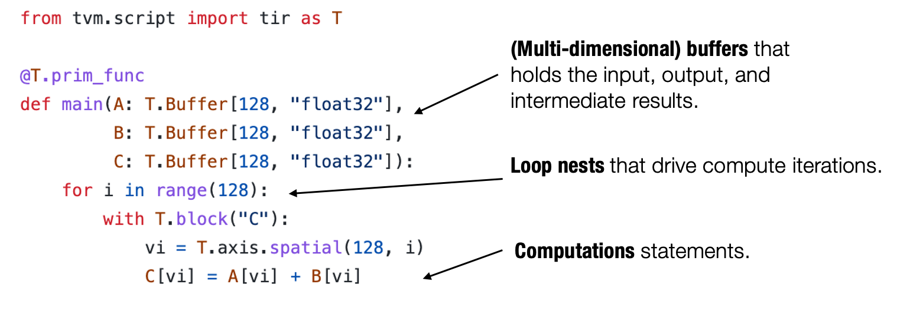

# 张量程序抽象

:label:`chap_tensor_program`

在本章中，我们将讨论对单个单元计算步骤的抽象以及在机器学习编译中对这些抽象的可能的变换。

## 元张量函数

在上一章的概述中，我们介绍到机器学习编译的过程可以被看作张量函数之间的变换。一个典型的机器学习模型的执行包含许多步将输入张量之间转化为最终预测的计算步骤，其中的每一步都被称为元张量函数 (primitive tensor function)。


:label:`fig_primitive_tensor_func`

在上面这张图中，张量算子 `linear`, `add`, `relu` 和 `softmax` 均为元张量函数。特别的是，许多不同的抽象能够表示（和实现）同样的元张量函数（正如下图所示）。我们可以选择调用已经预先编译的框架库（如 `torch.add` 和 `numpy.add`）并利用在 Python 中的实现。在实践中，元张量函数被例如 C 或 C++ 的低级语言所实现，并且在一些时候会包含一些汇编代码。


:label:`fig_tensor_func_abstractions`

许多机器学习框架都提供机器学习模型的编译过程，以将元张量函数变换为更加专门的、针对特定工作和部署环境的函数。


:label:`fig_tensor_func_transformation`

上面这张图展示了一个元张量函数 `add` 的实现被变换至另一个不同实现的例子，其中在右侧的代码是一段表示可能的组合优化的伪代码：左侧代码中的循环被拆分出长度为 `4` 的单元，`f32x4.add` 对应的是一个特殊的执行向量加法计算的函数。

## 张量程序抽象

上一节谈到了对元张量函数变换的需要。为了让我们能够更有效地变换元张量函数，我们需要一个有效的抽象来表示这些函数。

通常来说，一个典型的元张量函数实现的抽象包含了一下成分：存储数据的多维数组，驱动张量计算的循环嵌套以及计算部分本身的语句。


:label:`fig_tensor_func_elements`

我们称这类抽象为 ``张量程序抽象''。张量程序抽象的一个重要性质是，他们能够被一系列有效的程序变换所改变。


:label:`fig_tensor_func_seq_transform`

例如，我们能够通过一组变换操作（如循环拆分、并行和向量化）将上图左侧的一个初始循环程序变换为右侧的程序。

### 张量程序抽象中的其它结构

重要的是，我们不能任意地对程序进行变换，比方说这可能是因为一些计算会依赖于循环之间的顺序。但幸运的是，我们所感兴趣的大多数元张量函数都具有良好的属性（例如循环迭代之间的独立性）。

张量程序可以将这些额外的信息合并为程序的一部分，以使程序变换更加便利。


:label:`fig_tensor_func_iteration`

举个例子，上面图中的程序包含额外的 `T.axis.spatial` 标注，表明 `vi` 这个特定的变量被映射到循环变量 `i`，并且所有的迭代都是独立的。这个信息对于执行这个程序而言并非必要，但会使得我们在变换这个程序时更加方便。在这个例子中，我们知道我们可以安全地并行或者重新排序所有与 `vi` 有关的循环，只要实际执行中 `vi` 的值按照从 `0` 到 `128` 的顺序变化。

## 张量程序变换实践

### 安装相关的包

为了本课程的目标，我们会使用 TVM （一个开源的机器学习编译框架）中一些正在持续开发的部分。我们提供了下面的命令用于为 MLC 课程安装一个包装好的版本。

```bash
python3 -m  pip install mlc-ai-nightly -f https://mlc.ai/wheels
```

### 构造张量程序

让我们首先构造一个执行两向量加法的张量程序。

```{.python .input n=0}
import tvm
from tvm.ir.module import IRModule
from tvm.script import tir as T
import numpy as np
```

```{.python .input n=1}
@tvm.script.ir_module
class MyModule:
    @T.prim_func
    def main(A: T.Buffer[128, "float32"],
             B: T.Buffer[128, "float32"],
             C: T.Buffer[128, "float32"]):
        # extra annotations for the function
        T.func_attr({"global_symbol": "main", "tir.noalias": True})
        for i in range(128):
            with T.block("C"):
                # declare a data parallel iterator on spatial domain
                vi = T.axis.spatial(128, i)
                C[vi] = A[vi] + B[vi]
```

TVMScript 是一种让我们能以 Python 抽象语法树的形式来表示张量程序的方式。注意到这段代码并不实际对应一个 Python 程序，而是对应一个机器学习编译过程中的张量程序。TVMScript 的语言设计是为了与 Python 语法所对应，并在 Python 语法的基础上增加了能够帮助程序分析与变换的额外结构。

```{.python .input n=2}
type(MyModule)
```

`MyModule` 是 `IRModule` 数据结构的一个实例，是一组张量函数的集合。

我们可以通过 `script` 函数得到这个 IRModule 的 TVMScript 表示。这个函数对于在一步步程序变换间检查 IRModule 而言非常有帮助。

```{.python .input n=3}
print(MyModule.script())
```

### 编译与运行

在任何时刻，我们都可以通过 `build` 将一个 IRModule 转化为可以执行的函数。

```{.python .input n=4}
rt_mod = tvm.build(MyModule, target="llvm")  # The module for CPU backends.
type(rt_mod)
```

在编译后，`mod` 包含了一组可以执行的函数。我们可以通过这些函数的名字拿到对应的函数。

```{.python .input n=5}
func = rt_mod["main"]
func
```

```{.python .input n=6}
a = tvm.nd.array(np.arange(128, dtype="float32"))
b = tvm.nd.array(np.ones(128, dtype="float32"))
c = tvm.nd.empty((128,), dtype="float32")
```

要执行这个函数，我们在 TVM runtime 中创建三个 `NDArray`，然后执行调用这个函数。

```{.python .input n=7}
func(a, b, c)
```

```{.python .input n=8}
print(a)
```
```{.python .input n=9}
print(b)
```
```{.python .input n=10}
print(c)
```

### 张量程序变换

现在我们开始变换张量程序。一个张量程序可以通过一个辅助的名为调度（schedule）的数据结构得到变换。

```{.python .input n=11}
sch = tvm.tir.Schedule(MyModule)
type(sch)
```

我们首先尝试拆分循环。

```{.python .input n=12}
# Get block by its name
block_c = sch.get_block("C")
# Get loops surrounding the block
(i,) = sch.get_loops(block_c)
# Tile the loop nesting.
i_0, i_1, i_2 = sch.split(i, factors=[None, 4, 4])
print(sch.mod.script())
```

我们可以对这些循环重新排序。现在我们将 `i_2` 移动到 `i_1` 的外侧。

```{.python .input n=13}
sch.reorder(i_0, i_2, i_1)
print(sch.mod.script())
```

最后，我们可以标注我们想要并行最外层的循环。

```{.python .input n=14}
sch.parallel(i_0)
print(sch.mod.script())
```

我们能够编译并运行变换后的程序。

```{.python .input n=15}
transformed_mod = tvm.build(sch.mod, target="llvm")  # The module for CPU backends.
transformed_mod["main"](a, b, c)
print(c)
```

### 通过张量表达式（Tensor Expression，TE）构造张量程序

在之前的例子中，我们直接使用 TVMScript 构造张量程序。在实际中，通过现有的定义方便地构造这些函数是很有帮助的。张量表达式（tensor expression）是一个帮助我们将一些可以通过表达式表示的张量计算转化为张量程序的 API。

```{.python .input n=16}
# namespace for tensor expression utility
from tvm import te

# declare the computation using the expression API
A = te.placeholder((128, ), name="A")
B = te.placeholder((128, ), name="B")
C = te.compute((128,), lambda i: A[i] + B[i], name="C")

# create a function with the specified list of arguments.
func = te.create_prim_func([A, B, C])
# mark that the function name is main
func = func.with_attr("global_symbol", "main")
ir_mod_from_te = IRModule({"main": func})

print(ir_mod_from_te.script())
```

### 变换一个矩阵乘法程序

在上面的例子中，我们展示了如何变换一个向量加法程序。现在我们尝试应用一些变换到一个稍微更复杂的的程序——矩阵乘法程序。我们首先使用张量表达式 API 构造初始的张量程序，并编译执行它。

```{.python .input n=17}
from tvm import te

M = 1024
K = 1024
N = 1024

# The default tensor type in tvm
dtype = "float32"

target = "llvm"
dev = tvm.device(target, 0)

# Algorithm
k = te.reduce_axis((0, K), "k")
A = te.placeholder((M, K), name="A")
B = te.placeholder((K, N), name="B")
C = te.compute((M, N), lambda m, n: te.sum(A[m, k] * B[k, n], axis=k), name="C")

# Default schedule
func = te.create_prim_func([A, B, C])
func = func.with_attr("global_symbol", "main")
ir_module = IRModule({"main": func})
print(ir_module.script())


func = tvm.build(ir_module, target="llvm")  # The module for CPU backends.

a = tvm.nd.array(np.random.rand(M, K).astype(dtype), dev)
b = tvm.nd.array(np.random.rand(K, N).astype(dtype), dev)
c = tvm.nd.array(np.zeros((M, N), dtype=dtype), dev)
func(a, b, c)

evaluator = func.time_evaluator(func.entry_name, dev, number=1)
print("Baseline: %f" % evaluator(a, b, c).mean)
```

我们可以变换张量程序中的循环，使得在新循环下内存访问的模式对缓存更加友好。我们尝试下面的调度。

```{.python .input n=18}
sch = tvm.tir.Schedule(ir_module)
type(sch)
block_c = sch.get_block("C")
# Get loops surrounding the block
(y, x, k) = sch.get_loops(block_c)
block_size = 32
yo, yi = sch.split(y, [None, block_size])
xo, xi = sch.split(x, [None, block_size])

sch.reorder(yo, xo, k, yi, xi)
print(sch.mod.script())

func = tvm.build(sch.mod, target="llvm")  # The module for CPU backends.

c = tvm.nd.array(np.zeros((M, N), dtype=dtype), dev)
func(a, b, c)

evaluator = func.time_evaluator(func.entry_name, dev, number=1)
print("after transformation: %f" % evaluator(a, b, c).mean)
```

尝试改变 `batch_size` 的值，看看你能得到怎样的性能。在实际情况中，我们会利用一个自动化的系统在一个可能的变换空间中搜索找到最优的程序变换。

## 总结

- 元张量函数表示机器学习模型计算中的单个单元计算。
  - 一个机器学习编译过程可以有选择地转换元张量函数的实现。
- 张量程序是一个表示元张亮函数的有效抽象。
  - 关键成分包括: 多维数组，循环嵌套，计算语句。
  - 程序变换可以被用于加速张量程序的执行。
  - 张量程序中额外的结构能够为程序变换提供更多的信息。
